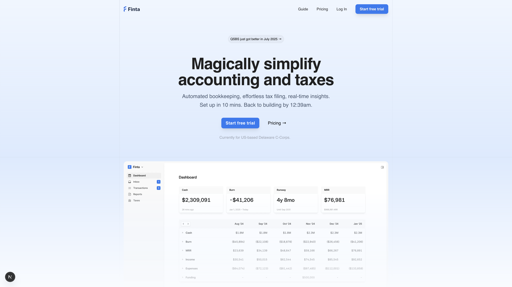

# Finta Landing Page

This is a landing page built with Next.js and Tailwind CSS.



## Getting Started

First, install dependencies using pnpm (as per project guidelines):

```bash
pnpm install
```

Then, run the development server:

```bash
pnpm dev
```

Open [http://localhost:3000](http://localhost:3000) with your browser to see the result.

## Project Structure

- `src/app/page.tsx`: Main page component
- `src/components/`: Reusable components like Hero, Navbar, Container
- `public/`: Static assets including images

## Learn More

- [Next.js Documentation](https://nextjs.org/docs)
- [Tailwind CSS Documentation](https://tailwindcss.com/docs)

## Deployment

Deploy easily on Vercel or your preferred platform.
